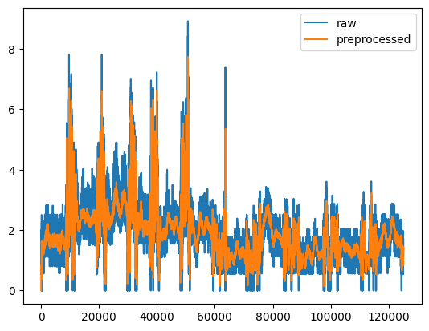
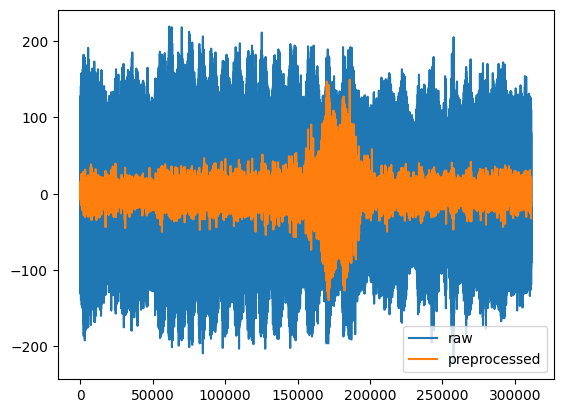

C memory alignment making life difficult
```
00000000: 11111111 11111111 11111111 11111111 11111111 11111111  ......
00000006: 11111111 11111111 11111111 11111111 11111111 11111111  ......
0000000c: 11111111 11111111 11111111 11111111 11111111 11111111  ......
00000012: 11111111 11111111 11111111 01111111 11111111 11111111  ......
00000018: 11111111 11111111 11111111 11111111 00000000 00000000  ......
0000001e: 00000000 00000000                                      ..
```
this represents a struct that I dumped to file...
I set all the values to their max value, but for some reason C adds 4 bytes at the end. Probably because 32bit are a better struct size on 64bit? idk

Only took me like 5 hours, but now I can read the dump files from C in python.

Next step is to compare all the values in a test and check which ones are actually used and not 0

---

# CSI Data
in order to use DeepSeg's preprocessing, our collected data needs to be brought into a compatible shape.

Instead of just using the 8bit signed integer (-128, 127), DeepSeg uses the `scaled_csi` of the Linux CSI Tool. The scaling is depending on the signal itself (signal power, noise power, SNR, ...) but is only applied linearly to the csi values itself.

Because the inputs are linearly scaled to (-1, 1) for the NN later on anyways, this means that our data with ranges of (-512, 511) should work just fine after being scaled down to the same range.
We can't apply the same scaling algorithm to our data, because the Atheros CSI Tool doesn't provide the noise measurements. (It was supposed to be added at some point, but the last commit to the repository is from 6 years ago...I don't think it's ever coming)

---

Compared to their data, our own is very noisy. The botterworth low pass filter also can't clean this up. Furthermore it removes a lot of the characteristic data that's a result of human movement

<div>


</div>

Our data is a lot more noisy, theirs has a somewhat clear line that then deviates because of activity. Whereas ours wildly fluctuates.
This might be because of a busy measuring environment with lots of wifi devices around us.
Might set up a measuring test on the grass outside of the building to reduce the amount of interference.

---

Troubles getting their stuff to run.

Their matlab scripts fail:
- `/`, `\` issues
- matlab newer than 7.3 doesn't use the hdf5 file format anymore, which creates issues with loading in python

- python3.7 required to get tensorflow 1.X running, needed for the model
- no requirements.txt for python

