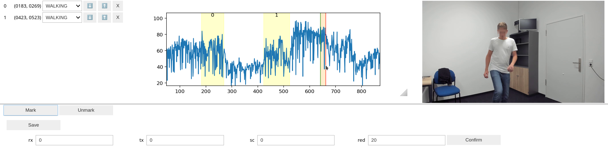

# BachelorThesis - Evaluating the Generalisability of Segmentation Methods in Wifi Sensing

> Wi-Fi has become more important in recent years besides the function of providing network connectivity.
 It is being repurposed for sensing through analysis of Channel State Information.
 Wi-Fi Sensing can be utilized in many ensing applications like presence and activity detection.  
 One challenge of Wi-Fi Sensing is to overcome the fact that most approaches still require fixed hardware and are limited to their training environment.  
 Segementation of CSI is handled as one step towards efficient and accurate sensing.  
 In this thesis, we test the interoperability of segmentation techniques on data collected with different hardware with a case study. An existing deep learning-based method "DeepSeg" is used to evaluate activity data in a new environment.  
 With a maximum performance of 90% for segmentation, this approach promises compatibility for different data collection processes.  
 Further, we highlight challenges in the robustness of existing methods and contribute our tools for public use.

## Contents
This repository contains the material of my bachelor thesis, including code, dataset, and documentation.

## Dateset
The dateset available in the [Releases](https://github.com/FelixDobler/BachelorThesis-WiFi-Sensing-Segmentation/releases) contains 290 labeled activities of 10 different activity kinds, performed by one user.
The acquisition methods are detailed in the [thesis](./Dobler_Felix_Evaluating_the_Generalisability_of_Segmentation_Methods_in_Wifi_Sensing.pdf).

The data can be read using the [csidata](./csidata/) python package.
